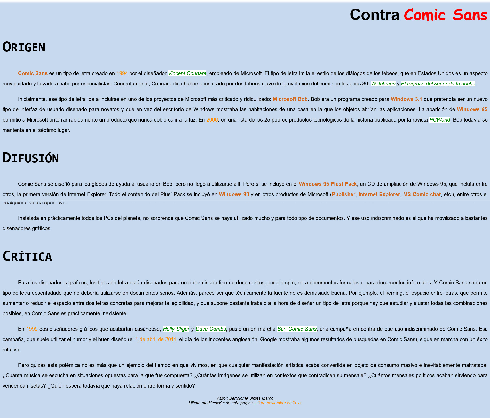

# Ejercicio de refuerzo de textos

## Instrucciones

A partir de la siguiente captura de pantalla

Intenta reproducir en el archivo __html__ el resultado.

## Etiquetas recomendas:

h1, h2, strong, em, mark, p

## Propiedades recomendas: 

color, justify-content, background-color, text-indent